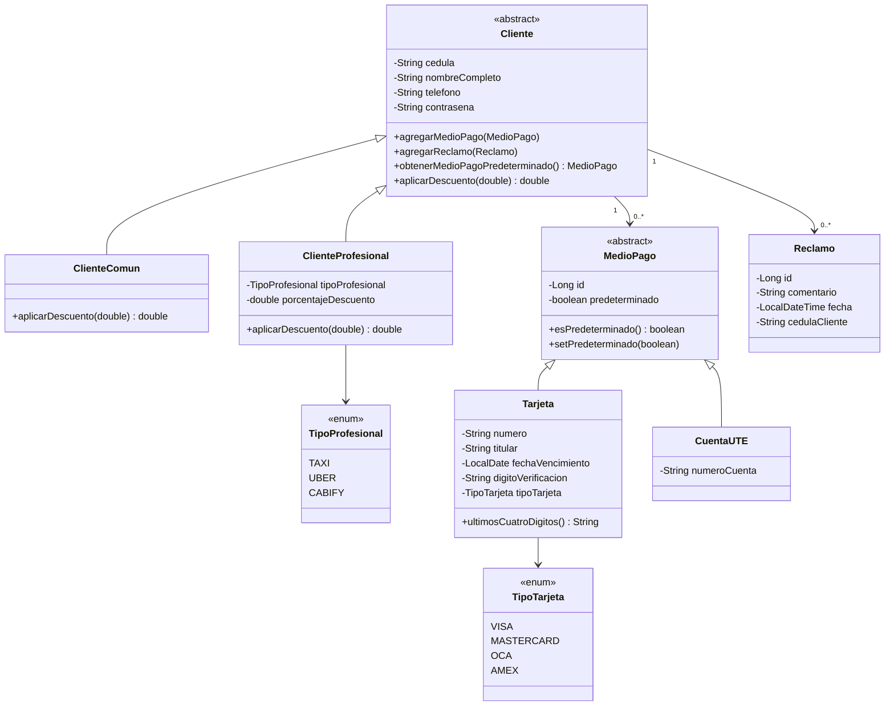
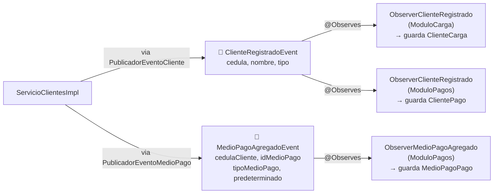
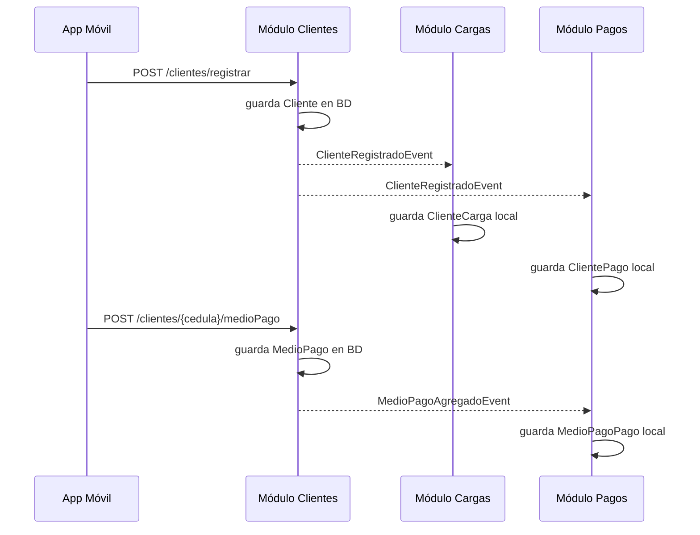
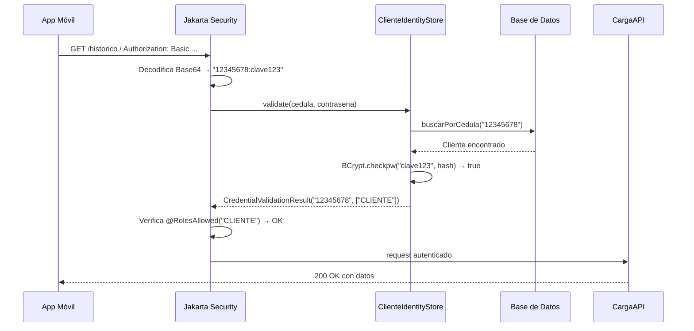
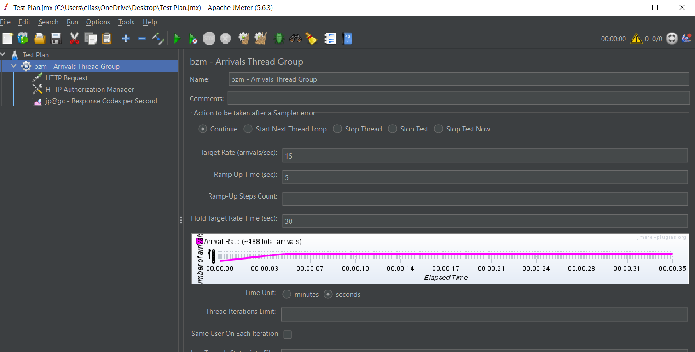
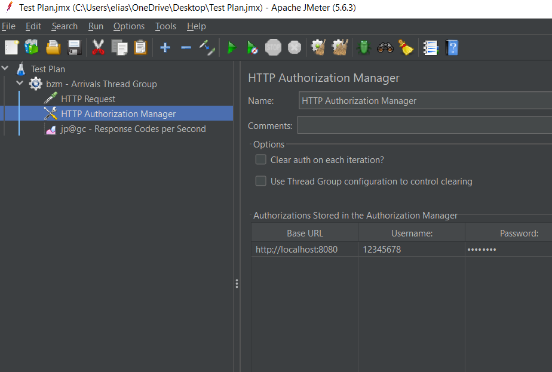
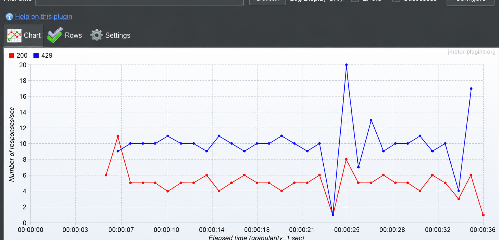
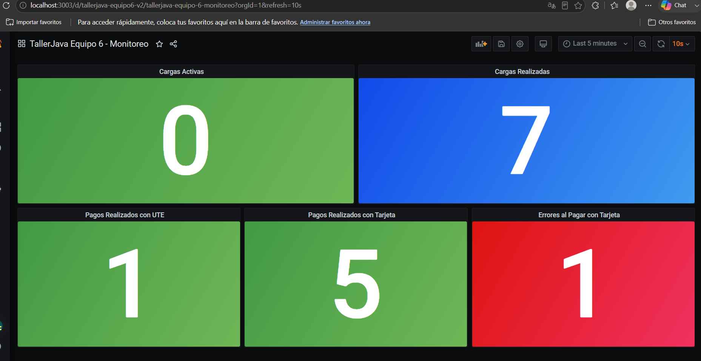

# Sistema de Gestión de Movilidad Eléctrica

> **Taller Java 2026 — UTEC Maldonado**  
> Iteración 1: Lógica de Negocio

---

## Índice

### Iteración 1
- [Descripción General](#descripción-general)
- [Decisiones de Diseño](#decisiones-de-diseño)
- [Arquitectura del Sistema](#arquitectura-del-sistema)
- [Estructura de Paquetes](#estructura-de-paquetes)
- [Módulo Clientes](#módulo-clientes)
- [Módulo Cargas](#módulo-cargas)
- [Módulo Pagos](#módulo-pagos)
- [Comunicación entre Módulos](#comunicación-entre-módulos)

### Iteración 2
- [Seguridad — API REST App Móvil](#seguridad--api-rest-app-móvil)
- [Pagos — API REST App Movil](#pagos--api-rest-app-móvil)

### Iteración 3
- [Observabilidad — Monitoreo con Grafana e InfluxDB](#iteración-3--observabilidad)
- [Cómo funciona internamente](#como-funciona-internamente)
- [Decisiones de diseño — Monitoreo](#decisiones-de-diseño--monitoreo)
- [Levantar el entorno de observabilidad](#levantar-el-entorno-de-observabilidad)
- [Curls de prueba — Monitoreo](#curls-de-prueba--monitoreo)

---

## Descripción General

El sistema permite gestionar la carga de vehículos eléctricos. Los clientes se registran, asocian medios de pago y utilizan estaciones de carga. Al finalizar una carga el cobro se realiza de forma automática, interactuando con los sistemas externos de pago (tarjetas o facturación UTE).

El backend está implementado como un **monolito modular** sobre **Jakarta EE**, siguiendo lineamientos de diseño que permiten una futura migración a microservicios con mínimo impacto. Cada módulo posee su propio esquema de base de datos y se comunica con los demás únicamente a través de interfaces o eventos CDI, garantizando bajo acoplamiento.

> **Referencias de diseño:**
> - [Jakarta EE — CDI Specification](https://jakarta.ee/specifications/cdi/)
> - [Microservices Patterns — Sam Newman](https://samnewman.io/books/building_microservices/)

---

## Decisiones de Diseño

- **Tres módulos principales**: Clientes, Cargas y Pagos. Cada uno es independiente y tiene
  sus propias clases de dominio y sus propias tablas en la base de datos.

- **Los módulos no se llaman directamente**: se comunican solo por eventos CDI.
  Si el módulo Clientes necesita avisarle algo al módulo Pagos, dispara un evento.
  Ningún módulo importa clases de dominio de otro.

- **Capas bien separadas dentro de cada módulo**: dominio, aplicación, interfaz e infraestructura.
  El dominio no sabe nada de HTTP, ni de base de datos, ni de eventos. Solo tiene lógica de negocio.

- **Persistencia con JPA/Hibernate sobre MariaDB**. Cada módulo maneja sus propias tablas.

- **Inyección de dependencias con CDI**. El contenedor de Jakarta EE resuelve las dependencias
  en tiempo de ejecución, sin que las clases se instancien entre sí manualmente.

---

## Arquitectura del Sistema

### Diagrama de Sistemas / Subsistemas

```
┌─────────────┐         ┌──────────────────────────────────────────────┐        ┌────────────────────┐
│  Hardware   │         │                   Backend                    │        │  Sistemas Externos │
│             │         │                                              │        │                    │
│  Cargador ──┼────────►│  ┌──────────────────────────────────────┐   │───────►│  Medio de Pago     │
│  (software) │         │  │          «Core» GestorMovilidad      │   │        │  (Visa/Master/etc) │
└─────────────┘         │  │                                      │   │───────►│  Facturación UTE   │
                        │  │  ┌─────────┐ ┌────────┐ ┌────────┐  │   │        └────────────────────┘
┌─────────────┐         │  │  │Clientes │ │ Cargas │ │ Pagos  │  │   │
│  Frontend   │         │  │  └─────────┘ └────────┘ └────────┘  │   │
│             │         │  └──────────────────────────────────────┘   │
│  App Móvil ─┼────────►│                                              │
│  Gestor Web─┼────────►│                                              │
└─────────────┘         └──────────────────────────────────────────────┘
```

### Diagrama de Capas (por módulo)

Cada módulo sigue la siguiente estructura de capas, de menor a mayor nivel de abstracción:

```
┌──────────────────────────────────────────────────────────────┐
│                     Infraestructura                          │  ← Código transversal, persistencia JPA
├──────────────────────────────────────────────────────────────┤
│                       Interface                              │  ← APIs REST, eventos CDI, interfaces locales
├──────────────────────────────────────────────────────────────┤
│                      Aplicación                              │  ← Casos de uso / servicios
├──────────────────────────────────────────────────────────────┤
│                       Dominio                                │  ← Entidades y lógica de negocio
└──────────────────────────────────────────────────────────────┘
```

> La justificación de este diseño en capas responde al patrón **Layered Architecture**, donde cada capa sólo depende de la inmediatamente inferior, facilitando pruebas unitarias por capa y la eventual separación en servicios independientes.  
> Referencia: [Clean Architecture — Robert C. Martin](https://blog.cleancoder.com/uncle-bob/2012/08/13/the-clean-architecture.html)

---

## Estructura de Paquetes

```
src/main/java/org/tallerjava/
├── ModuloCliente/
│   ├── dominio/
│   │   ├── Cliente.java
│   │   ├── ClienteComun.java
│   │   ├── ClienteProfesional.java
│   │   ├── MedioPago.java
│   │   ├── Tarjeta.java
│   │   ├── CuentaUTE.java
│   │   ├── Reclamo.java
│   │   └── repositorio/
│   │       └── ClienteRepositorio.java
│   ├── aplicacion/
│   │   ├── ServicioClientes.java
│   │   └── impl/
│   │       └── ServicioClientesImpl.java
│   ├── Interface/
│   │   ├── local/
│   │   │   └── InterfaceLocalCliente.java
│   │   └── evento/
│   │       └── out/
│   │           ├── PublicadorEventoCliente.java
│   │           ├── PublicadorEventoMedioPago.java
│   │           ├── ClienteRegistradoEvent.java
│   │           └── MedioPagoAgregadoEvent.java
│   └── infraestructura/
│       └── persistencia/
│           └── ClienteRepositorioImpl.java
│
├── ModuloCarga/
│   ├── dominio/
│   │   ├── Carga.java
│   │   ├── Cargador.java
│   │   ├── EstacionCarga.java
│   │   ├── ClienteCarga.java
│   │   ├── EstadoCarga.java
│   │   ├── EstadoCargador.java
│   │   └── repositorio/
│   │       ├── CargaRepositorio.java
│   │       ├── CargadorRepositorio.java
│   │       ├── ClienteCargaRepositorio.java
│   │       └── EstacionRepositorio.java
│   ├── aplicacion/
│   │   ├── ServicioCarga.java
│   │   └── impl/
│   │       └── ServicioCargaImpl.java
│   ├── Interface/
│   │   ├── remota/rest/
│   │   │   └── CargaAPI.java
│   │   └── evento/in/
│   │       └── ObserverClienteRegistrado.java
│   └── infraestructura/
│       └── persistencia/
│           └── EstacionRepositorioImpl.java
│
└── ModuloPago/
    ├── dominio/
    │   ├── Pago.java
    │   ├── ClientePago.java
    │   ├── EstadoPago.java
    │   └── repositorio/
    │       ├── PagoRepositorio.java
    │       └── ClientePagoRepositorio.java
    ├── aplicacion/
    │   ├── ServicioPago.java
    │   └── impl/
    │       └── ServicioPagoImpl.java
    ├── Interface/
    │   ├── local/
    │   │   └── InterfaceLocalPago.java
    │   ├── remota/rest/
    │   │   └── PagoAPI.java
    │   └── evento/in/
    │       └── ObserverClienteRegistrado.java
    └── infraestructura/
        └── persistencia/
            └── PagoRepositorioImpl.java
```

---

## Módulo Clientes


### Modelo de dominio



### Casos de uso

| Caso de uso | Consumidor | Qué hace |
|-------------|------------|----------|
| `registrarCliente` | App móvil | Registra un cliente nuevo, hashea la contraseña y avisa a los otros módulos |
| `altaMedioPago` | App móvil | Agrega un medio de pago al cliente. El primero que se agrega queda como predeterminado |
| `obtenerClientes` | Gestor web | Devuelve la lista de todos los clientes registrados |
| `realizarReclamo` | App móvil | Guarda un reclamo del cliente con su comentario y la fecha del sistema |

### Cómo se implementó cada caso de uso

**registrarCliente**

La API recibe un `ClienteDTO`. El DTO tiene un método `build()` que decide qué subclase
crear: si el tipo es `PROFESIONAL` crea un `ClienteProfesional` con su descuento,
si es `COMUN` crea un `ClienteComun`. Esta decisión vive en el DTO para no ensuciar el servicio.

El `tipoProfesional` llega como String y se convierte a mayúsculas antes de pasarlo a
`TipoProfesional.valueOf()`, para que no falle si viene en minúscula.

Antes de guardar, el servicio verifica que no exista otro cliente con esa cédula.
Si ya existe, lanza `IllegalStateException` y la API responde `400 BAD REQUEST`.
La contraseña se hashea con BCrypt, nunca se guarda en texto plano.

Al terminar, se dispara `ClienteRegistradoEvent` con la cédula, nombre y tipo del cliente
(solo datos primitivos, sin objetos de dominio) para que Cargas y Pagos guarden su copia.

**altaMedioPago**

La API recibe un `MedioPagoDTO`. El `build()` del DTO crea la subclase correcta:
`Tarjeta` o `CuentaUTE` según el campo `tipo`.

La lógica de cuál es el predeterminado está en el dominio, en `Cliente.agregarMedioPago()`:
si la lista de medios de pago está vacía, el nuevo medio queda como predeterminado automáticamente.
El servicio no necesita saber nada de eso.

Al responder, el número de tarjeta se enmascara con `**** **** **** XXXX` usando
`tarjeta.ultimosCuatroDigitos()`. El dígito de verificación nunca se incluye en la respuesta.

Se dispara `MedioPagoAgregadoEvent` con el id técnico, el tipo y si es predeterminado.
Nunca se manda el número de tarjeta en el evento.

**obtenerClientes**

El servicio devuelve los objetos `Cliente` de la base de datos, pero la API los convierte
a `ClienteDTO` con `ClienteDTO.convertirDTO(cliente)` antes de responder. Eso hace que
la contraseña hasheada nunca salga en la respuesta HTTP aunque esté en el objeto de dominio.

**realizarReclamo**

La API recibe un `ReclamoDTO` con el comentario. El servicio crea un `Reclamo` nuevo
pasando el comentario y la cédula — la fecha la pone el constructor con `LocalDateTime.now()`,
el cliente no puede manipularla. Luego llama a `cliente.agregarReclamo()` y persiste.

Si la cédula no existe, lanza `IllegalArgumentException` y la API devuelve `400 BAD REQUEST`.

### Eventos que produce



### Diagrama de secuencia — Flujo de eventos



### Endpoints REST

| Método | URL | Body | Respuesta |
|--------|-----|------|-----------|
| `POST` | `/api/clientes/registrar` | `ClienteDTO` | `201` cédula del cliente |
| `POST` | `/api/clientes/{cedula}/medioPago` | `MedioPagoDTO` | `200` mensaje de confirmación |
| `GET` | `/api/clientes` | — | `200` lista de clientes (sin contraseña) |
| `POST` | `/api/clientes/{cedula}/reclamos` | `ReclamoDTO` | `201` mensaje de confirmación |

### Ejemplos curl

**Registrar cliente común:**
```bash
curl -X POST http://localhost:8080/TallerJavaEquipo6/api/clientes/registrar \
  -H "Content-Type: application/json" \
  -d '{
    "cedula": "12345678",
    "nombreCompleto": "Juan Perez",
    "telefono": "099123456",
    "contrasena": "clave123",
    "tipo": "COMUN"
  }'
```

**Registrar cliente profesional:**
```bash
curl -X POST http://localhost:8080/TallerJavaEquipo6/api/clientes/registrar \
  -H "Content-Type: application/json" \
  -d '{
    "cedula": "98765432",
    "nombreCompleto": "Maria Garcia",
    "telefono": "098456789",
    "contrasena": "clave456",
    "tipo": "PROFESIONAL",
    "tipoProfesional": "TAXI",
    "porcentajeDescuento": 15.0
  }'
```

**Agregar tarjeta:**
```bash
curl -X POST http://localhost:8080/TallerJavaEquipo6/api/clientes/12345678/medioPago \
  -H "Content-Type: application/json" \
  -d '{
    "tipo": "TARJETA",
    "numero": "4111111111111111",
    "titular": "Juan Perez",
    "fechaVencimiento": "2027-12-01",
    "digitoVerificacion": "123",
    "tipoTarjeta": "VISA"
  }'
```

**Agregar cuenta UTE:**
```bash
curl -X POST http://localhost:8080/TallerJavaEquipo6/api/clientes/12345678/medioPago \
  -H "Content-Type: application/json" \
  -d '{
    "tipo": "UTE",
    "numeroCuenta": "UTE-987654"
  }'
```

**Realizar reclamo:**
```bash
curl -X POST http://localhost:8080/TallerJavaEquipo6/api/clientes/12345678/reclamos \
  -H "Content-Type: application/json" \
  -d '{"comentario": "El cargador no funciona"}'
```

**Obtener todos los clientes:**
```bash
curl http://localhost:8080/TallerJavaEquipo6/api/clientes
```

---

## Módulo Cargas

### Responsabilidad

Gestiona el ciclo de vida completo de una carga eléctrica: inicio, consulta en tiempo real, histórico y finalización. Además administra la infraestructura de estaciones y cargadores. Al finalizar una carga, delega el cobro al **Módulo Pagos** a través de su interfaz local.

### Diagrama UML — Dominio

```
  ┌──────────────────────────────┐           ┌──────────────────────────────┐
  │        EstacionCarga         │ 1    1..*  │           Cargador           │
  ├──────────────────────────────┤────────────┤──────────────────────────────┤
  │ - idEstacion: long           │  contiene  │ - idCargador: long           │
  │ - descripcion: String        │            │ - tipo: TipoCargador         │
  │ - calle: String              │            │ - tieneCable: boolean        │
  │ - departamento: String       │            │ - tipoConector: TipoConector │
  │ - longitud: int              │            │ - estado: EstadoCargador     │
  │ - latitud: int               │            │ - tiempoEstimadoFin          │
  └──────────────────────────────┘            │ - potenciaMinima: int        │
                                              └──────────────┬───────────────┘
                                                             │ 0..1 registra
                                                             ▼
  ┌─────────────────────────┐            ┌───────────────────────────────────┐
  │       ClienteCarga      │            │               Carga               │
  ├─────────────────────────┤            ├───────────────────────────────────┤
  │ - cedula: String        │ 0..* realiza│ - idCarga: long                  │
  │ - nombre: String        │────────────│ - fecha: LocalDate                │
  │ - tipo: String          │            │ - horaInicio: LocalDateTime       │
  └─────────────────────────┘            │ - horaFin: LocalDateTime          │
                                         │ - importeTotal: float             │
                                         │ - recargoPorDemora: float         │
                                         │ - porcentajeAvance: int           │
                                         │ - estado: EstadoCarga             │
                                         │ - idCargador: long                │
                                         │ - idMedioPago: long               │
                                         └───────────────────────────────────┘
```

**Estados del cargador:** `DISPONIBLE` → `OCUPADO` → `DISPONIBLE` / `FUERA_DE_SERVICIO`

**Estados de la carga:** `INICIADA` → `COMPLETADA`

### Interfaz de Servicio (`ServicioCarga`)

| Método | Consumidor | Descripción |
|--------|-----------|-------------|
| `iniciarCarga(String cedulaCliente, long idCargador, long idMedioPago) : long` | App móvil | Inicia una carga para el cliente indicado en el cargador especificado. Valida que el cliente exista en el módulo, que no tenga una carga activa y que el cargador esté `DISPONIBLE`. Retorna el `idCarga` generado. Cambia el estado del cargador a `OCUPADO`. |
| `verCargaActual(String cedulaCliente) : Carga` | App móvil | Retorna la carga en estado `INICIADA` del cliente, o `null` si no existe carga activa. |
| `verHistorico(String cedulaCliente, LocalDate fechaIni, LocalDate fechaFin) : List<Carga>` | App móvil | Retorna el historial de cargas completadas del cliente en el rango de fechas indicado. |
| `finalizarCarga(long idCargador, float consumoKwh, int minutosDemora)` | Cargador (hardware) | Invocado por el software del cargador cuando el cable es desconectado. Calcula el importe de energía (`consumoKwh × 5.0`) y el recargo por demora (`minutosDemora × 2.0`). Persiste la carga como `COMPLETADA`, libera el cargador y delega el cobro a `InterfaceLocalPago.pagarCarga()`. |
| `altaEstacion(EstacionCarga estacion) : long` | Gestor web | Da de alta una nueva estación de carga. Retorna el `idEstacion` generado. |
| `altaCargador(long idEstacion, Cargador cargador) : long` | Gestor web | Da de alta un cargador asociado a una estación existente. Valida que la estación exista. Retorna el `idCargador` generado. |
| `obtenerEstaciones() : List<EstacionCarga>` | App móvil | Retorna todas las estaciones de carga registradas con sus cargadores. |

### Tarifas aplicadas

| Concepto | Tarifa |
|----------|--------|
| Energía | $5.00 por kWh |
| Demora por no desconexión | $2.00 por minuto |

### Diagrama de Secuencia — Proceso Principal

```
Cliente         ModuloCarga       Cargador         ModuloPago
   │                │                │                  │
   │─iniciarCarga()─►                │                  │
   │                │──iniciar()────►│                  │
   │                │◄─────ok────────│                  │
   │                │                │                  │
   │                │   ... tiempo después ...           │
   │                │                │                  │
   │                │◄─finalizarCarga()─────────────────│
   │                │                │                  │
   │                │────────────────────pagarCarga()──►│
   │                │◄───────────────────ok pago────────│
```

---

## Módulo Pagos

### Responsabilidad

Gestiona el registro y consulta de pagos realizados por los clientes. Expone la `InterfaceLocalPago` que consume el Módulo Cargas al finalizar una carga. Opera sobre su propio contexto de cliente (`ClientePago`) que se sincroniza mediante eventos.

### Dominio

```
  ┌────────────────────────┐          ┌────────────────────────────┐
  │       ClientePago      │  0..*    │            Pago            │
  ├────────────────────────┤──────────┤────────────────────────────┤
  │ - cedula: String       │  tiene   │ - idPago: long             │
  │ - nombre: String       │          │ - cedula: String           │
  │ - tipo: String         │          │ - importe: int (centavos)  │
  └────────────────────────┘          │ - idMedioPago: long        │
                                      │ - estado: EstadoPago       │
                                      │ - fecha: LocalDateTime     │
                                      └────────────────────────────┘
```

### Interfaz de Servicio (`ServicioPago`)

| Método | Consumidor | Descripción |
|--------|-----------|-------------|
| `altaPago(String cedula, Pago pago)` | Interno | Persiste un nuevo pago y lo asocia al cliente en el repositorio local del módulo. |
| `consultarPagos(String cedula, LocalDate fechaIni, LocalDate fechaFin) : List<Pago>` | Gestor web | Retorna la lista de pagos del cliente en el rango de fechas indicado. Permite conciliar los pagos contra el histórico de cargas del Módulo Cargas. |

### Interfaz Local (`InterfaceLocalPago`)

Implementada por `ServicioPagoImpl`, consumida directamente por el Módulo Cargas mediante inyección CDI:

| Método | Descripción |
|--------|-------------|
| `pagarCarga(String cedula, int importe, Long idMedioPago) : boolean` | Registra el cobro de una carga. El importe se recibe en centavos. Retorna `true` si el pago fue procesado correctamente. En esta iteración actúa como stub; en una iteración futura integrará con los sistemas externos (Visa/Master y Facturación UTE). |

### API REST — Endpoints disponibles

| Verbo | Path | Descripción |
|-------|------|-------------|
| `GET` | `/pagos/{cedula}/listarPagos?fechaIni=&fechaFin=` | Consulta pagos de un cliente en el rango de fechas. |

### Ejemplos curl

**Consultar Pagos por Fecha:**
```bash
curl -X GET "http://localhost:8080/TallerJavaEquipo6/api/pagos/12345678/listarPagos?fechaIni=2026-05-01&fechaFin=2026-05-31"
```

---

## Comunicación entre Módulos

Los módulos se comunican de dos formas, priorizando siempre el bajo acoplamiento:

**1. Eventos CDI (asincrónico, preferido)**  
Cuando la operación no requiere retorno de valores, se utiliza el sistema de eventos CDI (`jakarta.enterprise.event.Event`). El módulo productor publica el evento sin conocer quién lo consume.

```
ModuloCliente ──► ClienteRegistradoEvent ──► ModuloCarga  (ObserverClienteRegistrado)
                                         └──► ModuloPago   (ObserverClienteRegistrado)
```

**2. Interfaces locales (sincrónico, cuando se requiere valor de retorno)**  
Cuando el resultado de la llamada es necesario para continuar el flujo (como el cobro al finalizar una carga), se utiliza una interfaz local que el módulo consumidor inyecta mediante CDI.

```
ModuloCarga ──► InterfaceLocalPago.pagarCarga() ──► ServicioPagoImpl
```

> Esta estrategia de comunicación está alineada con el patrón **Anti-Corruption Layer** y el principio de **módulos desacoplados**, base para una futura transición a microservicios.  
> Referencia: [Domain-Driven Design — Eric Evans, Cap. 14](https://www.domainlanguage.com/ddd/)

### Restricción de diseño

> No está permitida la comunicación directa entre clases de distintos módulos fuera de las interfaces declaradas en el paquete `Interface`. Cada módulo mantiene su propio repositorio de datos (tablas separadas dentro de la misma base de datos).

---

*Documentación para la Iteración 1 — Taller Java 2026, UTEC Maldonado.*

---

<br>

---

## Iteración 2 — Integración con Sistemas Externos

> **Taller Java 2026 — UTEC Maldonado**  
> Iteración 2: Integración con Sistemas Externos y Seguridad

En esta iteración el sistema se integra con actores externos, se expone la API REST al exterior y se agregan mecanismos de seguridad para proteger los endpoints utilizados por la App Móvil.

El backend cumple dos roles: actúa como servidor (expone endpoints para la App Móvil, el Gestor Web y el Cargador) y actúa como cliente (consume los servicios externos de Medio de Pago y Facturación UTE).

---

## Seguridad — API REST App Móvil

Se protegió la API REST de la App Móvil con autenticación, autorización y un límite de consultas en el endpoint de histórico.

### Qué se hizo

Se agregó seguridad a los endpoints que usa la App Móvil. Para poder usarlos, el cliente tiene que identificarse con su cédula y contraseña. Además, se puso un límite de consultas en el endpoint de histórico para que no se pueda abusar de él.

---

### Cómo funciona la autenticación — Basic Auth

Cuando la App Móvil hace una consulta, manda en el encabezado del request la cédula y contraseña del cliente codificadas en Base64:

```
Authorization: Basic MTIzNDU2N....
```

Lo que viaja es simplemente `cedula:contraseña` en Base64. Es importante aclarar que Base64 **no es encriptación** — cualquiera que intercepte el request puede decodificarlo facilmente. En un sistema productivo, Basic Auth se usa siempre sobre HTTPS, que encripta todo el trafico y hace que las credenciales no sean legibles aunque alguien las intercepte. En este proyecto se omite HTTPS porque la letra no lo requiere para esta iteracion.

WildFly y Jakarta Security decodifican el header y llaman al `ClienteIdentityStore`, que busca al cliente en la base de datos y verifica la contraseña usando BCrypt.

#### Diagrama — qué pasa cuando se hace una consulta



Si la cédula o contraseña son incorrectas, el servidor responde **401 Unauthorized** sin llegar al endpoint.

---

### Qué endpoints requieren login

Por defecto, todos los endpoints están bloqueados (`@DenyAll` en la clase). Cada método declara explícitamente si es público o requiere login.

| Endpoint | Acceso | Quién lo usa |
|----------|--------|-------|
| `POST /api/clientes/registrar` | Público | Cualquiera |
| `GET /api/clientes` | Público | Gestor Web |
| `POST /api/cargas/estaciones` | Público | Gestor Web |
| `GET /api/cargas/estaciones` | Público | Gestor Web |
| `POST /api/cargas/cargadores` | Público | Gestor Web |
| `POST /api/clientes/{cedula}/medioPago` | Requiere login | App Móvil |
| `POST /api/clientes/{cedula}/reclamos` | Requiere login | App Móvil |
| `POST /api/cargas/iniciar` | Requiere login | App Móvil |
| `POST /api/cargas/finalizar` | Requiere login | App Móvil |
| `GET /api/cargas/activa` | Requiere login | App Móvil |
| `GET /api/cargas/historico` | Requiere login + límite de consultas | App Móvil |
| `GET /api/pagos/{cedula}/listarPagos` | Requiere login | App Móvil |

---

### Verificación de que cada cliente solo accede a sus propios datos

No alcanza con verificar que el cliente esté logueado. También se verifica que solo pueda operar sobre sus propios datos. Si el cliente `12345678` intenta consultar o modificar datos del cliente `111111`, el servidor le responde **403 Forbidden**.

| Código | Qué significa |
|--------|-------------|
| `401 Unauthorized` | No se identificó o la contraseña es incorrecta |
| `403 Forbidden` | Está logueado pero está intentando acceder a datos de otro cliente u otro rol |

---

### RATE LIMITER - Límite de consultas en `/historico`

El endpoint de histórico genera mucha carga en la base de datos, por eso se le puso un límite usando el algoritmo **Token Bucket** (balde de tokens):

```
Balde con 10 tokens al arrancar
├── Cada consulta consume 1 token
├── Si no hay tokens → 429 Too Many Requests
└── Se agregan 5 tokens por segundo
```

En la práctica el sistema deja pasar hasta 5 consultas por segundo de forma continua. Las primeras 10 pasan todas gracias a los tokens iniciales del balde.

#### Cómo se configuró la prueba en JMeter

**Arrivals Thread Group** — define cuántos requests por segundo manda JMeter:



| Parámetro | Valor | Qué significa |
|-----------|-------|-------------|
| Target Rate | 15 | 15 consultas por segundo |
| Ramp Up Time | 5 seg | Tarda 5 segundos en llegar a las 15 consultas/seg |
| Hold Target Rate Time | 30 seg | Mantiene esa carga durante 30 segundos |

**HTTP Request** — define a qué endpoint apunta cada consulta:


Apunta a `GET /TallerJavaEquipo6/api/cargas/historico` en `localhost:8080` con los parámetros `cedulaCliente=12345678`, `fechaIni=2026-01-01` y `fechaFin=2026-12-31`.

**HTTP Authorization Manager** — agrega las credenciales a cada consulta automáticamente:



Configura `username=12345678` y `password=clave123` para `http://localhost:8080`. JMeter las codifica en Base64 y las manda en el header `Authorization: Basic ...` de cada consulta, simulando exactamente lo que haría la App Móvil.

#### Resultado — gráfica Response Codes per Second



- **Línea roja (200):** consultas que llegaron al servidor y fueron respondidas — había lugar en el balde. Al principio la línea arranca más alta porque el balde empieza lleno con 10 tokens. Una vez que se gastan esos tokens iniciales, se estabiliza en 5 por segundo, que es cuántos tokens se agregan por segundo.
- **Línea azul (429):** consultas bloqueadas — el balde estaba vacío.

La relación entre la configuración y el resultado: JMeter manda 15 consultas por segundo, el límite deja pasar 5 (los que se recargan por segundo) y bloquea 10. Por eso rojo + azul = 15 en cada segundo — lo que cambia es cuántas pasan y cuántas son bloqueadas dependiendo de cuántos tokens haya en el balde en ese momento.

---

### Pruebas con curl

#### 1. Endpoints públicos — sin credenciales

```bash
# Registrar cliente
curl -X POST http://localhost:8080/TallerJavaEquipo6/api/clientes/registrar -H "Content-Type: application/json" -d "{\"cedula\":\"12345678\",\"nombreCompleto\":\"Juan Perez\",\"telefono\":\"099123456\",\"contrasena\":\"clave123\",\"tipo\":\"COMUN\"}"

# Ver clientes (verificar que se registró)
curl http://localhost:8080/TallerJavaEquipo6/api/clientes

# Crear estacion
curl -X POST http://localhost:8080/TallerJavaEquipo6/api/cargas/estaciones -H "Content-Type: application/json" -d "{\"descripcion\":\"Estacion Centro\",\"calle\":\"18 de Julio\",\"departamento\":\"Montevideo\",\"longitud\":-34,\"latitud\":-56}"

# Ver estaciones (verificar)
curl http://localhost:8080/TallerJavaEquipo6/api/cargas/estaciones

# Crear cargador
curl -X POST http://localhost:8080/TallerJavaEquipo6/api/cargas/cargadores -H "Content-Type: application/json" -d "{\"idEstacion\":1,\"tipo\":\"RAPIDO\",\"tieneCable\":true,\"tipoConector\":\"TIPO2\",\"potenciaMinima\":22}"
```

#### 2. Endpoints protegidos sin credenciales — deben dar 401

```bash
# Medio de pago sin credenciales
curl -X POST http://localhost:8080/TallerJavaEquipo6/api/clientes/12345678/medioPago -H "Content-Type: application/json" -d "{\"tipo\":\"TARJETA\",\"numero\":\"1234567890123456\",\"tipoTarjeta\":\"VISA\",\"fechaVencimiento\":\"2027-12-01\"}"

# Reclamo sin credenciales
curl -X POST http://localhost:8080/TallerJavaEquipo6/api/clientes/12345678/reclamos -H "Content-Type: application/json" -d "{\"comentario\":\"El cargador no funciona\"}"

# Iniciar carga sin credenciales
curl -X POST http://localhost:8080/TallerJavaEquipo6/api/cargas/iniciar -H "Content-Type: application/json" -d "{\"cedulaCliente\":\"12345678\",\"idCargador\":1,\"idMedioPago\":1}"

# Finalizar carga sin credenciales
curl -X POST http://localhost:8080/TallerJavaEquipo6/api/cargas/finalizar -H "Content-Type: application/json" -d "{\"idCargador\":1,\"consumoKwh\":15.5,\"minutosDemora\":0}"

# Carga activa sin credenciales
curl "http://localhost:8080/TallerJavaEquipo6/api/cargas/activa?cedulaCliente=12345678"

# Historico sin credenciales
curl "http://localhost:8080/TallerJavaEquipo6/api/cargas/historico?cedulaCliente=12345678&fechaIni=2026-01-01&fechaFin=2026-12-31"

# Listar pagos sin credenciales
curl "http://localhost:8080/TallerJavaEquipo6/api/pagos/12345678/listarPagos?fechaIni=2026-01-01&fechaFin=2026-12-31"
```

#### 3. Flujo normal con credenciales correctas

```bash
# Agregar medio de pago
curl --user 12345678:clave123 -X POST http://localhost:8080/TallerJavaEquipo6/api/clientes/12345678/medioPago -H "Content-Type: application/json" -d "{\"tipo\":\"TARJETA\",\"numero\":\"1234567890123456\",\"tipoTarjeta\":\"VISA\",\"fechaVencimiento\":\"2027-12-01\"}"

# Hacer un reclamo
curl --user 12345678:clave123 -X POST http://localhost:8080/TallerJavaEquipo6/api/clientes/12345678/reclamos -H "Content-Type: application/json" -d "{\"comentario\":\"El cargador no funciona\"}"

# Iniciar carga
curl --user 12345678:clave123 -X POST http://localhost:8080/TallerJavaEquipo6/api/cargas/iniciar -H "Content-Type: application/json" -d "{\"cedulaCliente\":\"12345678\",\"idCargador\":1,\"idMedioPago\":1}"

# Ver carga activa (verificar que esta iniciada)
curl --user 12345678:clave123 "http://localhost:8080/TallerJavaEquipo6/api/cargas/activa?cedulaCliente=12345678"

# Finalizar carga
curl --user 12345678:clave123 -X POST http://localhost:8080/TallerJavaEquipo6/api/cargas/finalizar -H "Content-Type: application/json" -d "{\"idCargador\":1,\"consumoKwh\":15.5,\"minutosDemora\":0}"
```

#### 4. Verificación de acceso a datos propios — debe dar 403

```bash
# Cliente 12345678 intenta operar sobre datos de otro cliente
curl --user 12345678:clave123 -X POST http://localhost:8080/TallerJavaEquipo6/api/clientes/111111/medioPago -H "Content-Type: application/json" -d "{\"tipo\":\"TARJETA\",\"numero\":\"1234567890123456\",\"tipoTarjeta\":\"VISA\",\"fechaVencimiento\":\"2027-12-01\"}"
```

#### 5. Escenario A — Pago aprobado (requiere ServicioMedioPagoMock corriendo)

Los primeros 5 pagos siempre se aprueban.

```bash
# Iniciar carga
curl --user 12345678:clave123 -X POST http://localhost:8080/TallerJavaEquipo6/api/cargas/iniciar -H "Content-Type: application/json" -d "{\"cedulaCliente\":\"12345678\",\"idCargador\":1,\"idMedioPago\":1}"

# Finalizar carga — pago COMPLETADO, cliente no queda bloqueado
curl --user 12345678:clave123 -X POST http://localhost:8080/TallerJavaEquipo6/api/cargas/finalizar -H "Content-Type: application/json" -d "{\"idCargador\":1,\"consumoKwh\":15.5,\"minutosDemora\":0}"

# Verificar que puede iniciar otra carga
curl --user 12345678:clave123 -X POST http://localhost:8080/TallerJavaEquipo6/api/cargas/iniciar -H "Content-Type: application/json" -d "{\"cedulaCliente\":\"12345678\",\"idCargador\":1,\"idMedioPago\":1}"

# Finalizar para dejar el cargador libre
curl --user 12345678:clave123 -X POST http://localhost:8080/TallerJavaEquipo6/api/cargas/finalizar -H "Content-Type: application/json" -d "{\"idCargador\":1,\"consumoKwh\":10.0,\"minutosDemora\":0}"
```

#### 6. Escenario B — Pago rechazado (requiere ServicioMedioPagoMock corriendo)

El mock aprueba los primeros 5 pagos y rechaza el 6to. Ejecutar este comando 5 veces para llegar al rechazo:

```bash
# Ciclos 2, 3, 4, 5 y 6 — ejecutar 5 veces
curl --user 12345678:clave123 -X POST http://localhost:8080/TallerJavaEquipo6/api/cargas/iniciar -H "Content-Type: application/json" -d "{\"cedulaCliente\":\"12345678\",\"idCargador\":1,\"idMedioPago\":1}" && curl --user 12345678:clave123 -X POST http://localhost:8080/TallerJavaEquipo6/api/cargas/finalizar -H "Content-Type: application/json" -d "{\"idCargador\":1,\"consumoKwh\":15.5,\"minutosDemora\":0}"
```

En el 6to ciclo el pago queda RECHAZADO y el cliente queda bloqueado.

```bash
# Verificar que quedo bloqueado — responde que tiene deuda pendiente
curl --user 12345678:clave123 -X POST http://localhost:8080/TallerJavaEquipo6/api/cargas/iniciar -H "Content-Type: application/json" -d "{\"cedulaCliente\":\"12345678\",\"idCargador\":1,\"idMedioPago\":1}"
```

#### 7. Verificaciones finales

```bash
# Ver historico completo de cargas
curl --user 12345678:clave123 "http://localhost:8080/TallerJavaEquipo6/api/cargas/historico?cedulaCliente=12345678&fechaIni=2026-01-01&fechaFin=2026-12-31"

# Ver todos los pagos — aparecen COMPLETADO y RECHAZADO segun los escenarios ejecutados
curl --user 12345678:clave123 "http://localhost:8080/TallerJavaEquipo6/api/pagos/12345678/listarPagos?fechaIni=2026-01-01&fechaFin=2026-12-31"
```

---
---

### Impacto en el Módulo Pagos — Bloqueo por deuda

La integración con APIPago introdujo una nueva regla de negocio: un cliente con un pago
rechazado queda **bloqueado** y no puede iniciar nuevas cargas hasta que regularice su
situación. El mecanismo se implementó en dos capas:

**En `ClientePago`** (dominio de ModuloPago):
- Se agregó el atributo `bloqueadoPorDeuda: boolean`.
- `ServicioPagoImpl` lo actualiza a `true` cuando el resultado de APIPago es negativo.

**En `ServicioCargaImpl`** (aplicación de ModuloCarga):
- Antes de iniciar una carga, se consulta `InterfaceLocalPago.clienteHabilitadoParaCargar(cedula)`.
- Si retorna `false`, se lanza `IllegalStateException` con el mensaje correspondiente y
  la API responde `400 BAD REQUEST`.

```
ModuloCarga                          ModuloPago
    │                                    │
    │── clienteHabilitadoParaCargar() ──►│
    │◄─ false (bloqueadoPorDeuda=true) ──│
    │
    └── throw IllegalStateException("Cliente bloqueado por deuda pendiente")
```

Esta comunicación utiliza la **interfaz local** (`InterfaceLocalPago`) y no un evento CDI,
dado que el resultado es necesario sincrónicamente para decidir si se permite o no la
operación.

---

### Consideración sobre la disponibilidad de APIPago

El sistema fue diseñado para degradarse de forma segura (*fail-safe*) ante la ausencia
del mock externo. Si APIPago no está desplegado, `ServicioPagoImpl` captura la excepción
de red, registra un aviso en el log de WildFly y persiste el pago como `RECHAZADO`.
Esto significa que **las pruebas del core del negocio pueden realizarse sin APIPago**,
obteniendo siempre pagos rechazados, lo que permite verificar el bloqueo de clientes
sin necesidad de levantar el segundo artefacto.

---


### Pagos — API REST App Movil

---

## Iteración 3 — Observabilidad

> **Taller Java 2026 — UTEC Maldonado**
> Iteración 3: Observabilidad con Micrometer, InfluxDB y Grafana

En esta iteración se incorporó monitoreo de métricas de negocio en tiempo real. El sistema registra automáticamente eventos clave del negocio y los envía a InfluxDB, donde Grafana los visualiza en un dashboard con actualización cada 10 segundos.

---

### Arquitectura de observabilidad

```
WildFly (ModuloMonitoreo)
  └── RegistradorDeMetricas (@ApplicationScoped)
        └── Micrometer — InfluxMeterRegistry (1.9.x)
              └── InfluxDB 1.8.2  <──  Grafana 7.2.0 (dashboard)
```

Los eventos de negocio generados por `ModuloCarga` y `ModuloPago` son escuchados por observers CDI en `ModuloMonitoreo`. Estos invocan al `RegistradorDeMetricas`, que actualiza los `AtomicInteger` correspondientes en memoria. Micrometer los envía a InfluxDB automaticamente cada 10 segundos a traves del `InfluxMeterRegistry`.

---

### Stack tecnológico

| Herramienta | Versión | Rol |
|---|---|---|
| Micrometer | 1.9.17 | Instrumentación Java — compatible con InfluxDB 1.x |
| InfluxDB | 1.8.2 | Base de datos de series temporales para métricas |
| Grafana | 7.2.0 | Visualización del dashboard |
| Docker | - | Contenedor único con InfluxDB + Grafana |

> **Nota sobre versiones:** Micrometer 1.10+ cambió el cliente de InfluxDB apuntando por defecto a la API v2. La imagen de la cátedra usa InfluxDB 1.x, por lo que se utiliza Micrometer 1.9.17 que usa la API v1 de forma nativa.
> Referencia: [Micrometer InfluxDB Registry](https://micrometer.io/docs/registry/influx)

---

### Métricas implementadas

| Métrica | Descripción | Producida por |
|---|---|---|
| `cargasActivas` | Cargas de vehículos en curso en este momento | `ObserverModuloCarga` |
| `cargasRealizadas` | Total de cargas completadas acumuladas | `ObserverModuloCarga` |
| `pagosTarjeta` | Total de pagos exitosos con tarjeta acumulados | `ObserverModuloPago` |
| `pagosUTE` | Total de pagos exitosos con cuenta UTE acumulados | `ObserverModuloPago` |
| `erroresTarjeta` | Total de pagos rechazados con tarjeta acumulados | `ObserverModuloPago` |

---

### Por que se creo un modulo de monitoreo separado

El monitoreo es una responsabilidad transversal — afecta a varios modulos del sistema pero no pertenece a ninguno de ellos. Si hubieramos metido el codigo de metricas dentro de `ModuloCarga` o `ModuloPago`, esos modulos empezarian a tener dos responsabilidades al mismo tiempo: la logica de negocio y el registro de metricas. Eso viola el principio de responsabilidad unica y hace el codigo mas dificil de mantener.

Separarlo en `ModuloMonitoreo` tiene una ventaja concreta: si mañana queremos sacar el monitoreo del sistema o cambiar de InfluxDB a otro sistema, solo tocamos ese modulo. `ModuloCarga` y `ModuloPago` no se tocan porque no saben que el monitoreo existe.

---

### Clases que se agregaron para esta iteracion

**En `ModuloCarga/Interface/evento/out/`:**
- `EventoCargaIniciada` — clase vacia que representa que se inicio una carga. No necesita datos porque solo queremos saber que el evento ocurrio.
- `EventoCargaFinalizada` — representa que una carga fue finalizada. Tiene un constructor vacio para que el modulo de monitoreo lo use sin necesidad de los datos del negocio, y un constructor con datos para otros usos.
- `PublicadorEventoCarga` — se encarga de lanzar los eventos anteriores usando `Event.fire()` de CDI. `ServicioCargaImpl` lo llama al final de `iniciarCarga()` y `finalizarCarga()`.

**En `ModuloPago/Interface/evento/out/`:**
- `EventoPagoRealizado` — lleva el tipo de medio de pago (`"TARJETA"` o `"UTE"`) para que el observer pueda decidir que metrica actualizar.
- `EventoPagoRechazado` — clase vacia que representa un pago rechazado por el sistema externo.
- `PublicadorEventoPagoRealizado` — lanza `EventoPagoRealizado` cuando el pago es aprobado (con el tipo de medio) y `EventoPagoRechazado` cuando es rechazado.

**En `ModuloMonitoreo/Interface/evento/in/`:**
- `ObserverModuloCarga` — escucha `EventoCargaIniciada` y `EventoCargaFinalizada`. Cuando los recibe llama al `RegistradorDeMetricas` para actualizar las metricas correspondientes.
- `ObserverModuloPago` — escucha `EventoPagoRealizado` y `EventoPagoRechazado`. Segun el tipo de medio de pago que trae el evento, actualiza `pagosTarjeta` o `pagosUTE`. Si es un rechazo, actualiza `erroresTarjeta`.

**En `ModuloMonitoreo/infraestructura/`:**
- `RegistradorDeMetricas` — la unica clase que sabe como hablar con InfluxDB. Guarda las constantes con los nombres de las metricas, mantiene los `AtomicInteger` en memoria y se comunica con InfluxDB a traves de Micrometer.

---

### Como funciona internamente

`RegistradorDeMetricas` es un bean `@ApplicationScoped` — existe una sola instancia para toda la aplicacion. Dentro del `@PostConstruct` se configura `InfluxConfig`, que le dice a Micrometer dos cosas: el nombre de la base de datos en InfluxDB (`metricasTallerJava`) y cada cuanto tiempo enviar las metricas de forma automatica (cada 10 segundos). Con esa configuracion se crea el `InfluxMeterRegistry`, que es el objeto que realmente sabe como hablar con InfluxDB.

Luego se registran las 5 metricas como `Gauge`. Un `Gauge` es un tipo de metrica que le dice a Micrometer "cuando necesites el valor de esta metrica, lee el `AtomicInteger` que te estoy pasando". Se registran en el `@PostConstruct` porque el `meterRegistry` ya existe en ese punto y porque registrarlos dentro de algun metodo que se llama con cada evento causaria registros duplicados.

Cada 10 segundos Micrometer lee automaticamente los 5 `AtomicInteger` y manda sus valores a InfluxDB. Del lado de Grafana, los datos no llegan solos — Grafana consulta activamente a InfluxDB cada cierto tiempo para actualizar los paneles del dashboard.

Se uso `AtomicInteger` en lugar de un `int` comun porque WildFly maneja multiples requests en paralelo. Si dos cargas se iniciaran al mismo tiempo y usaramos un `int` normal, podrian pisarse entre si y el contador quedaria mal. `AtomicInteger` garantiza que cada operacion de incremento o decremento sea atomica e indivisible.

---

### Decisiones de diseño — Monitoreo

**Por que se uso Gauge para todas las metricas y no Counter**

Conceptualmente, metricas como `cargasRealizadas` o `pagosTarjeta` serian contadores que solo suben — en Micrometer existe el tipo `Counter` exactamente para eso. Sin embargo, con `Counter` lo que se guarda en InfluxDB en cada ciclo es el delta, es decir siempre un 1 por cada llamada a `.increment()`. Cuando Grafana consulta InfluxDB con `last("value")` en un panel tipo Stat, ve siempre 1 sin importar cuantos eventos ocurrieron — el dashboard mostraria datos incorrectos.

Con `Gauge` + `AtomicInteger` en cambio, lo que se manda a InfluxDB en cada ciclo es el valor actual del `AtomicInteger`, que ya es el acumulado real. Si hubo 5 pagos con tarjeta, el `AtomicInteger` vale 5 y eso es lo que Grafana muestra. Por eso se unifico todo bajo este patron.

**Carga activa — la unica metrica que baja**

`cargasActivas` es diferente al resto porque representa el estado actual del sistema: cuantas cargas hay en curso ahora mismo. Sube con cada `iniciarCarga()` y baja con cada `finalizarCarga()`. Las otras cuatro metricas son historicas y solo suben. El `Gauge` + `AtomicInteger` resuelve esto de forma natural porque `decrementAndGet()` simplemente baja el valor del `AtomicInteger` y en el proximo ciclo de 10 segundos Micrometer lee ese valor y lo manda a InfluxDB.

**Por que el Gauge se registra en el @PostConstruct y no en cada evento**

El `Gauge` actua como un sensor que le dice a Micrometer donde leer el valor cuando necesita enviarlo. Se registra una sola vez al arrancar la aplicacion porque si se registrara cada vez que llega un evento, se estaria registrando el mismo sensor multiples veces, lo que causaria errores o datos duplicados en InfluxDB.

---

### Flujo de eventos hacia el módulo de monitoreo

```
ServicioCargaImpl.iniciarCarga()
  → PublicadorEventoCarga.publicarCargaIniciada()
    → ObserverModuloCarga.onCargaIniciada()
      → RegistradorDeMetricas.incrementarCargasActivas()  [+1]

ServicioCargaImpl.finalizarCarga()
  → PublicadorEventoCarga.publicarCargaFinalizada()
    → ObserverModuloCarga.onCargaFinalizada()
      → RegistradorDeMetricas.decrementarCargasActivas()  [-1]
      → RegistradorDeMetricas.incrementarCounter(CARGAS_REALIZADAS)  [+1]

ServicioPagoImpl.pagarCarga() — pago aprobado con TARJETA
  → PublicadorEventoPagoRealizado.publicarPagoAceptado("TARJETA")
    → ObserverModuloPago.onPagoRealizado()
      → RegistradorDeMetricas.pagosAprovadosTargeta()  [+1]

ServicioPagoImpl.pagarCarga() — pago aprobado con UTE
  → PublicadorEventoPagoRealizado.publicarPagoAceptado("UTE")
    → ObserverModuloPago.onPagoRealizado()
      → RegistradorDeMetricas.incrementarCounter(PAGOS_UTE)  [+1]

ServicioPagoImpl.pagarCarga() — pago rechazado
  → PublicadorEventoPagoRealizado.publicarPagoRechazado()
    → ObserverModuloPago.onPagoRechazado()
      → RegistradorDeMetricas.pagosRechazadosTargeta()  [+1]
```

---

### Levantar el entorno de observabilidad

**Requisito previo:** tener Docker Desktop instalado y corriendo.

**Primera vez:**

```powershell
# Desde la carpeta Proyecto/TallerJavaEquipo6/
docker compose up -d

# Crear la base de datos de metricas
docker exec observabilidad influx -execute "CREATE DATABASE metricasTallerJava"
```

**Desde la segunda vez:**

```powershell
docker compose up -d
```

**Accesos:**

| Servicio | URL | Usuario | Contraseña |
|---|---|---|---|
| Grafana | http://localhost:3003 | root | root |
| InfluxDB API | http://localhost:8086 | — | — |
| Chronograf | http://localhost:3004 | root | root |

---

### Configurar Grafana (primera vez)

1. Ingresar a http://localhost:3003 con `root / root`
2. Ir a **Connections → Data sources → Add data source → InfluxDB**
3. Completar los siguientes campos:

| Campo | Valor |
|---|---|
| URL | `http://localhost:8086` |
| Database | `metricasTallerJava` |
| User | `root` |
| Password | `root` |
| HTTP Method | `GET` |

4. Click en **Save & Test** — debe aparecer `Data source is working`

---

### Importar el dashboard

1. Ir a **Dashboards → Import → Upload JSON file**
2. Seleccionar `TallerJavaEquipo6-dashboard.json` (raíz del proyecto)
3. Seleccionar el datasource InfluxDB configurado
4. Click en **Import**

El dashboard muestra los 5 paneles con auto-refresh de 10 segundos y ventana de los últimos 5 minutos.

---

### Comandos Docker para el día a día

```powershell
docker compose up -d       # levantar el stack
docker compose down        # detener (los datos persisten en volumenes)
docker compose ps          # ver estado del contenedor
docker compose logs -f     # ver logs en tiempo real
```

---

### Verificar métricas directamente en InfluxDB

```powershell
# Ver todas las metricas registradas
docker exec observabilidad influx -execute "SHOW MEASUREMENTS" -database "metricasTallerJava"

# Ver el ultimo valor de cada metrica
docker exec observabilidad influx -execute "SELECT last(value) FROM cargasActivas" -database "metricasTallerJava"
docker exec observabilidad influx -execute "SELECT last(value) FROM cargasRealizadas" -database "metricasTallerJava"
docker exec observabilidad influx -execute "SELECT last(value) FROM pagosTarjeta" -database "metricasTallerJava"
docker exec observabilidad influx -execute "SELECT last(value) FROM pagosUTE" -database "metricasTallerJava"
docker exec observabilidad influx -execute "SELECT last(value) FROM erroresTarjeta" -database "metricasTallerJava"
```

---

### Curls de prueba — Monitoreo

Estos curls permiten verificar que las metricas se registran correctamente en InfluxDB y aparecen en el dashboard. Requieren tener Docker corriendo con el stack de observabilidad y WildFly levantado con el proyecto.

**Prerequisitos — crear los datos necesarios si no existen:**

```bash
# Registrar cliente
curl -X POST http://localhost:8080/TallerJavaEquipo6/api/clientes/registrar -H "Content-Type: application/json" -d "{\"cedula\":\"12345678\",\"nombreCompleto\":\"Juan Perez\",\"telefono\":\"099123456\",\"contrasena\":\"clave123\",\"tipo\":\"COMUN\"}"

# Crear estacion
curl -X POST http://localhost:8080/TallerJavaEquipo6/api/cargas/estaciones -H "Content-Type: application/json" -d "{\"descripcion\":\"Estacion Centro\",\"calle\":\"18 de Julio\",\"departamento\":\"Montevideo\",\"longitud\":-34,\"latitud\":-56}"

# Crear cargador
curl -X POST http://localhost:8080/TallerJavaEquipo6/api/cargas/cargadores -H "Content-Type: application/json" -d "{\"idEstacion\":1,\"tipo\":\"RAPIDO\",\"tieneCable\":true,\"tipoConector\":\"TIPO2\",\"potenciaMinima\":22}"

# Agregar medio de pago
curl --user 12345678:clave123 -X POST http://localhost:8080/TallerJavaEquipo6/api/clientes/12345678/medioPago -H "Content-Type: application/json" -d "{\"tipo\":\"TARJETA\",\"numero\":\"1234567890123456\",\"tipoTarjeta\":\"VISA\",\"fechaVencimiento\":\"2027-12-01\"}"
```

**Probar cargasActivas y cargasRealizadas:**

```bash
# Iniciar carga — cargasActivas debe subir a 1 en Grafana (esperar ~10 segundos)
curl --user 12345678:clave123 -X POST http://localhost:8080/TallerJavaEquipo6/api/cargas/iniciar -H "Content-Type: application/json" -d "{\"cedulaCliente\":\"12345678\",\"idCargador\":1,\"idMedioPago\":1}"

# Finalizar carga — cargasActivas vuelve a 0, cargasRealizadas sube a 1
curl --user 12345678:clave123 -X POST http://localhost:8080/TallerJavaEquipo6/api/cargas/finalizar -H "Content-Type: application/json" -d "{\"idCargador\":1,\"consumoKwh\":15.5,\"minutosDemora\":0}"
```

**Probar pagosTarjeta, pagosUTE y erroresTarjeta (requiere ServicioMedioPagoMock corriendo):**

```bash
# Pago aprobado con tarjeta — pagosTarjeta sube 1
curl --user 12345678:clave123 -X POST http://localhost:8080/TallerJavaEquipo6/api/cargas/iniciar -H "Content-Type: application/json" -d "{\"cedulaCliente\":\"12345678\",\"idCargador\":1,\"idMedioPago\":1}"
curl --user 12345678:clave123 -X POST http://localhost:8080/TallerJavaEquipo6/api/cargas/finalizar -H "Content-Type: application/json" -d "{\"idCargador\":1,\"consumoKwh\":10.0,\"minutosDemora\":0}"

# Repetir 5 veces para llegar al rechazo — el 6to pago es rechazado por el mock
# En el rechazo: erroresTarjeta sube 1 y pagosTarjeta no cambia
curl --user 12345678:clave123 -X POST http://localhost:8080/TallerJavaEquipo6/api/cargas/iniciar -H "Content-Type: application/json" -d "{\"cedulaCliente\":\"12345678\",\"idCargador\":1,\"idMedioPago\":1}" && curl --user 12345678:clave123 -X POST http://localhost:8080/TallerJavaEquipo6/api/cargas/finalizar -H "Content-Type: application/json" -d "{\"idCargador\":1,\"consumoKwh\":10.0,\"minutosDemora\":0}"
```

**Verificar en InfluxDB que los datos llegaron:**

```powershell
docker exec observabilidad influx -execute "SELECT last(value) FROM cargasActivas" -database "metricasTallerJava"
docker exec observabilidad influx -execute "SELECT last(value) FROM cargasRealizadas" -database "metricasTallerJava"
docker exec observabilidad influx -execute "SELECT last(value) FROM pagosTarjeta" -database "metricasTallerJava"
docker exec observabilidad influx -execute "SELECT last(value) FROM erroresTarjeta" -database "metricasTallerJava"
```

---

### Dashboard en funcionamiento



---

*Documentación para las Iteraciones 1, 2 y 3 — Taller Java 2026, UTEC Maldonado.*
